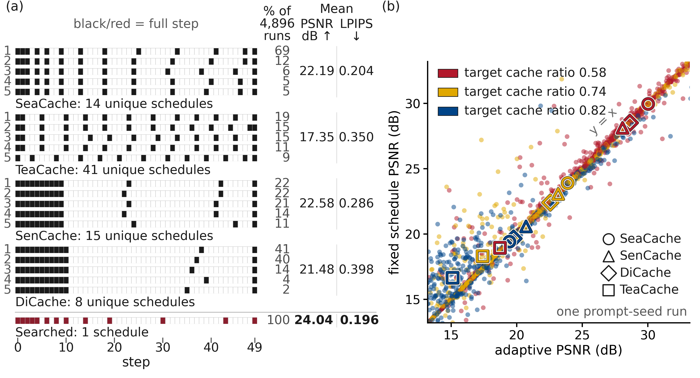
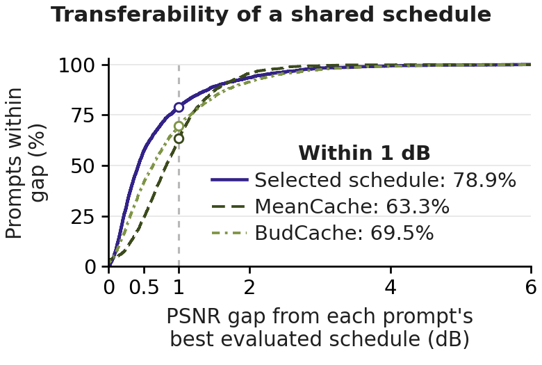

# The Golden Path Hypothesis: Reusable Schedules in Diffusion Caching

**Dong Wang, Wenwu Tang, Francesco Corti, Yun Cheng, Lothar Thiele, Olga Saukh**

[Research](#research-in-brief) ·
[Code and experiments](#research-and-code) ·
[Models and code structure](#models-and-code-structure) ·
[Setup](#setup-and-running-experiments) ·
[Citation](#citation-and-sources)

## Research in brief

Diffusion caching accelerates image and video generation by reusing or predicting
features at selected denoising steps. A **cache schedule** specifies which steps
run the full model and which use these approximations. The **cache ratio** is
the fraction of steps that use an approximation. We propose the **Golden
Path Hypothesis (GPH)**: with the model and inference settings held fixed,
schedules shared across prompts can achieve output quality comparable to the
best prompt-specific schedules. Such shared schedules are **golden paths**.

We test the GPH through schedule reuse, common denoising patterns, error
propagation, and search on a few examples. This repository provides the caching
implementations, experiment runners, and analysis code used in that study.



**Shared schedules retain quality across prompts.** Both panels use FLUX.1-dev
on PartiPrompts. **Left:** black or red cells mark full steps, and white cells
mark cached steps. Adaptive methods repeatedly choose a few schedules. The
searched schedule at the bottom is used in every run. **Right:** reusing each
method's most frequent schedule on new prompts gives mean output PSNR close to
that obtained when the method selects a schedule separately for each run.
Quality is measured against matching outputs
generated without caching. Higher PSNR and lower LPIPS indicate closer agreement.
[How to read the figure](docs/search-and-sharing.md#reading-the-overview-figure).

## Research and code

Choose the research question you want to investigate. The code links below open
the main implementations. The guides connect their inputs, generation and
evaluation commands, and analysis outputs.

| Research finding | Code entry points | Experiment guide |
|---|---|---|
| **Schedules can be shared.** Quality comparisons and exhaustive evaluation show that shared schedules can approach each prompt's best evaluated result. | [Schedule counts](analysis/analyze_native_schedule_paths.py), [paired quality analysis](analysis/replay_intervals.py), [exhaustive evaluation](flux/exhaustive_k41_runner.py) | [Schedule sharing and transfer](docs/search-and-sharing.md#schedule-recurrence-reuse-and-coverage) |
| **Denoising has common patterns.** Without caching, we measure how far the latent state moves and how its direction of motion changes at each step. These measurements follow similar patterns across prompts within each model. | [Image trajectory collection](flux/full_trajectory_probe.py), [image analysis](analysis/full_trajectory_analysis.py), [video analysis](analysis/video_trajectory/step_profiles.py) | [Trajectories](docs/trajectories-and-errors.md#full-compute-image-trajectories) |
| **Error propagation guides schedule evaluation.** An exact per-step error decomposition motivates scoring complete schedules by final-output quality. How features are reused or predicted also affects schedule quality. | [Error decomposition](flux/trajectory_deviation_runner.py), [single-step caching](flux/oracle_runner.py), [schedule–policy analysis](analysis/sp_cross.py) | [Error propagation](docs/trajectories-and-errors.md#current-approximation-errors-and-earlier-state-changes), [approximation policies](docs/spx.md) |
| **Search can find golden paths.** Standard search on a few examples finds schedules that retain quality on new prompts. Different quality objectives select different schedules. | [Search procedures](lib/schedule_search.py), [FLUX runner](flux/schedule_search_runner.py), [Qwen runner](qwen_image/schedule_search_runner.py) | [Search and validation](docs/search-and-sharing.md#search-and-validate-schedules) |

The [baseline guide](docs/baselines.md) covers the caching methods used in these
comparisons. The [calibration guide](docs/assets.md) explains how to prepare their
predictors, sensitivity measurements, and schedules.

<details>
<summary>Shared-schedule quality on new prompts</summary>

**One shared schedule approaches prompt-specific quality.** For FLUX.1-dev at
a cache ratio of 0.82, the selected schedule is within 1 dB of each prompt's best
evaluated PSNR on 78.9% of 2,381 new prompts.



The horizontal axis is the PSNR gap from each prompt's best result among 337
evaluated schedules. The vertical axis is the percentage of prompts within that
gap. PSNR is averaged over three seeds per prompt. All three schedules use the
same feature-reuse rule. [Selection and evaluation details](docs/search-and-sharing.md#evaluate-transfer-on-new-prompts).

</details>

## Models and code structure

Model-specific implementations are in [FLUX.1-dev](flux/), [Qwen-Image](qwen_image/),
[HunyuanVideo](hunyuan_video/), and [Wan2.1](wan21/).
The baseline study evaluates ten caching methods on images and nine on videos.
DPCache is included only in the image comparison. The three target cache ratios
are 0.58, 0.74, and 0.82.

| Directory | Role |
|---|---|
| [`lib/`](lib/) | Cache approximations, schedule definitions, and search procedures shared by the model implementations |
| [`evaluation/`](evaluation/) | Image and video quality metrics |
| [`analysis/`](analysis/) | Measurements, result aggregation, statistics, and figures |
| [`resources/`](resources/) | Provided schedules, experiment configurations, thresholds, and prompt splits |
| [`scripts/`](scripts/), [`RUN/`](RUN/) | Data preparation, external source setup, and experiment launch scripts |
| [`tests/`](tests/) | CPU unit tests for the included components |

## Setup and running experiments

```bash
git clone https://github.com/nanguoyu/Golden-Path-Hypothesis.git
cd Golden-Path-Hypothesis
```

Choose an experiment above, then follow [installation](docs/installation.md)
for its model. Prepare the [benchmark prompts](docs/data.md) and obtain the
model checkpoints from their [official sources](docs/assets.md#model-sources).
Methods that need fitted predictors or calibration measurements use the
[asset-building instructions](docs/assets.md).

Generation requires CUDA. Image generation, HunyuanVideo generation, and VBench
evaluation use separate environments. The current video generation and several
video calibration entry points require a Slurm compute node.
The [CPU analysis environment](docs/installation.md#cpu-analysis) supports
analysis of generated experiment outputs.

The [execution guide](docs/usage.md) covers data preparation, cluster commands,
output organization, and tests. It also contains an optional example that runs
a provided schedule. Each experiment guide gives the model-specific commands
and the protocol used for the paper.

## Citation and sources

Citation metadata and the author list are in [CITATION.cff](CITATION.cff).
The implementations build on the methods and tools listed in
[THIRD_PARTY.md](THIRD_PARTY.md). See [LICENSE](LICENSE) for licensing information.
